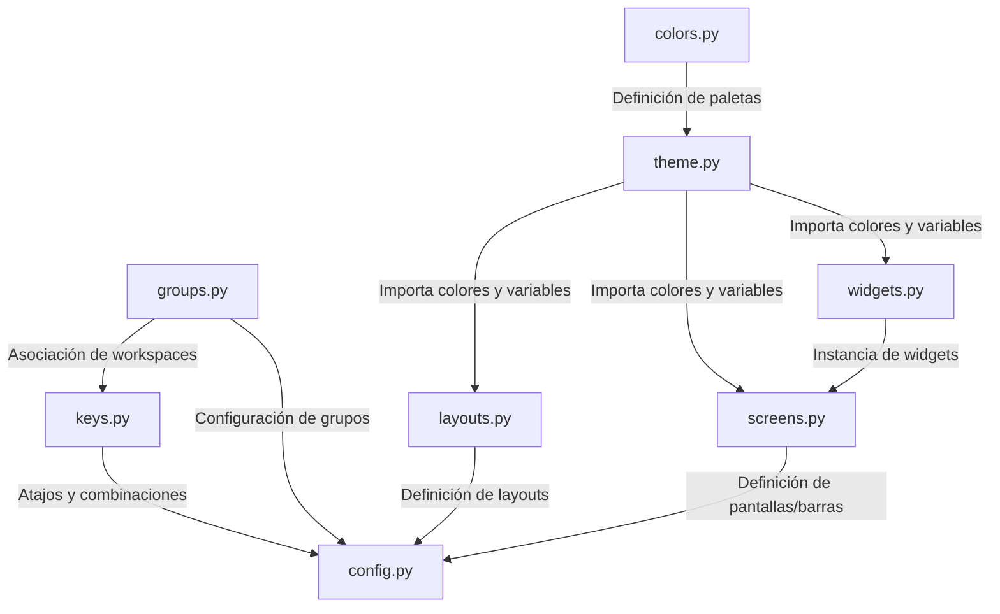

# 01 - Arquitectura de Kael OS

Kael OS ha sido estructurado siguiendo principios de modularidad estricta para garantizar mantenibilidad, evitar dependencias circulares y permitir que herramientas externas (como `thememenu`) puedan interactuar limpiamente con el sistema.

## Estructura de Archivos en `~/.config/qtile/`

El archivo monolítico original se dividió en los siguientes componentes:

*   **`theme.py`**: Almacena de forma centralizada la ejecución del tema activo (ej. `cyber_rasta()`). Todos los demás módulos de la interfaz consumen los colores de aquí.
*   **`config.py`**: El punto de entrada principal (orquestador). Importa todos los módulos individuales, gestiona los hooks de inicio (`autostart`, `set_wallpaper`) y define las interacciones físicas de ratón.
*   **`keys.py`**: Concentra la lógica de atajos de teclado (`keys`), las aplicaciones principales (`terminal`, `browser`), y las funciones para navegación dinámica y redimensionamiento.
*   **`groups.py`**: Define los workspaces del 1 al 12 (incluyendo reglas por clase de ventana) y la configuración de Scratchpads flotantes (TUI terminal y pulsemixer).
*   **`layouts.py`**: Define las reglas de redimensionamiento de las ventanas, los esquemas activos (`MonadTall`, `Bsp`, `Columns`, `TreeTab`, etc.) y las reglas de flotación para ventanas particulares.
*   **`widgets.py`**: Contiene la definición y personalización estética de todos los widgets individuales de la barra superior y los widgets dinámicos de iconos de la barra lateral izquierda.
*   **`screens.py`**: Instancia las pantallas físicas y asocia los widgets a las barras superior (`top`) y lateral izquierda (`left`).

---

## Flujo de Datos del Tema (Evitando Importaciones Circulares)

Para evitar la recursión de importaciones en Python, el flujo se diseñó así:



## Compatibilidad con `thememenu`

El script selector de temas `thememenu` edita directamente el archivo `$CONFIG` sustituyendo `= tema_anterior()` por `= tema_nuevo()`. 

Para preservar esta automatización sin romper el diseño modular, actualizamos `thememenu` para que su variable `CONFIG` apunte directamente a `theme.py` en lugar de `config.py`. De esta forma, cambiar de tema a través del menú de Rofi actualiza instantáneamente todo el entorno gráfico sin generar conflictos en Python.

---

## Barra Lateral Izquierda (Panel Contextual)

Se ha implementado una barra lateral izquierda de **`50px`** de ancho de tipo **Icon-Only** (sin texto descriptivo, centrada verticalmente) que provee información de contexto dinámica distribuida en 4 secciones:

1.  **Sección 1 - Ventanas Abiertas**: Muestra de forma acumulada los iconos de las aplicaciones activas en todos los workspaces (ej. ``, ``). Si hay múltiples instancias de la misma aplicación, acumula su contador (ej. `×2`). Al hacer click izquierdo, abre la selección de ventanas en Rofi (`rofi -show window`) para saltar directamente a ella.
2.  **Sección 2 - Almacenamiento Dinámico**: Muestra periféricos de almacenamiento externo montados en `/media/jose/` (ej. `` para USBs, `` para discos externos). Desaparecen al desmontarse. Click izquierdo abre `Thunar`; click derecho abre un selector interactivo en Rofi (`manage_drives`) para desmontar o expulsar de forma segura.
3.  **Sección 3 - Hardware Activo**: Detecta periféricos de hardware en uso y muestra sus iconos (ratón `󰍽`, teclado `󰌌`, auriculares/audio `󰋋`).
4.  **Sección 4 - Contexto de Desarrollo**: Escanea la infraestructura de desarrollo activa en segundo plano (entornos virtuales de Python `🐍`, docker `🐳`, django `🌐`, tmux/zellij ``).

### Integración con el Compositor (Picom)
Debido a que Qtile crea sus barras como ventanas internas X11 sin nombre de clase (`WM_CLASS`) ni tipo de ventana (`_NET_WM_WINDOW_TYPE`), Picom por defecto les aplicaba transparencias y bordes curvados de 10px. 

Para corregirlo, se configuraron reglas específicas en [`picom.conf`](file:///home/jose/.config/qtile/picom/picom.conf) utilizando la propiedad `_NET_WM_STATE` que contiene `_NET_WM_STATE_BELOW` para las barras. Esto remueve las esquinas redondeadas y la opacidad inactiva únicamente de las barras, dejándolas sólidas y de color negro absoluto:

```text
# Sin esquinas redondeadas en las barras de Qtile (por su propiedad de estado)
match = "window_type = 'dock' || window_type = 'desktop' || _NET_WM_STATE@[*]:a *= '_NET_WM_STATE_BELOW'";
corner-radius = 0;
```
